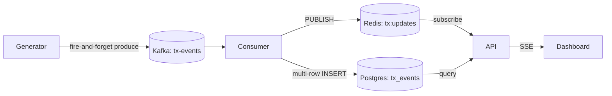

# Design Document

## Overview

This document describes the design of the prototype that satisfies `requirements.md`. It covers the architecture, the components and their interfaces, the data model, error-handling behavior, the rationale behind the major design decisions, and an honest ledger of where the running prototype's behavior differs from the letter of a requirement (and why that's an acceptable prototype-scope tradeoff rather than an oversight).

## Architecture

Two properties drive every choice below:

1. **The Generator never awaits Kafka.** A failed or slow produce is dropped and counted, never blocking. This is the entire mechanism behind Requirement 1 and, transitively, Requirement 19 (nothing here calls out to external infrastructure at all).
2. **Postgres is the only durable store.** Kafka exists solely to decouple the Generator from write load; Redis exists solely to fan out a "something changed" signal across horizontally-scaled API instances. Neither is a second copy of the data. This is why Requirements 2–9 all describe one query surface (`tx_events` via the API's filter-builder) rather than a store-per-read-pattern.

## Components and Interfaces

### Generator (`services/generator`)
- `config.ts` reads `TPS`, `TENANT_COUNT`, `HOT_TENANT_RATIO`, `HOT_TENANT_FRACTION`, `LATENCY_MEAN_MS`, `LATENCY_P99_MS`, and the `INCIDENT_*` variables from the environment.
- `index.ts` runs a `setInterval` loop at the configured TPS, builds a `TxEvent` (shared type), and calls the kafkajs producer's `send()` without `await`-ing it on the loop — `.then()`/`.catch()` update `sent`/`dropped` counters logged every 5s. Satisfies Requirement 1.
- Traffic shaping satisfies Requirement 1.7/1.8 directly: `hotTenantFraction` (default 0.1) and `hotTenantRatio` (default 0.6) implement the "hottest 10% of tenants get ~60% of traffic" distribution; `TPS` is operator-configurable up to and beyond 150.
- Incident mode (`maybeStartIncident`) implements Requirement 18 by tracking one active `{ tenantId, endsAt }` window and re-weighting outcome-code selection for that tenant while active.

### Consumer (`services/consumer`)
- `index.ts` subscribes to `tx-events` via kafkajs's `eachBatch`, buffers parsed events per batch, calls `insertBatch` (a single multi-row `INSERT`), then resolves offsets and commits only after the insert succeeds. Satisfies Requirement 3.
- After a successful insert, publishes to `tx:updates` via `ioredis`. Satisfies Requirement 4.1.
- A separate `setInterval` runs the retention `DELETE` every 30s (Requirement 16.2). `RETENTION_MINUTES` defaults to 60 and rejects smaller values so the longest current/prior comparison has complete source data.

### API (`services/api`)
- `auth.ts` and `routes/login.ts` issue/verify signed demo JWTs. Query role and tenant scope come only from verified claims; a global caller may narrow its own view but a tenant caller cannot widen it.
- `filters.ts` is the single parser both query routes call. Invalid enums and numeric values survive parsing long enough for `validateFilters` to reject them instead of silently falling back.
- `db.ts` enforces tenant scoping and executes four detail statements per refresh: trend, outcomes, recent rows, and combined current/prior aggregates. Global tenant health is a separate window-keyed aggregate cached for 2 seconds, so changing vendor/type/outcome does not issue that fifth statement or redefine the platform navigator. The health response is materialized against the known 50-tenant directory so quiet tenants remain visible with zero/null metrics.
- `routes/query.ts` — `/api/query`, satisfies Requirement 9.
- `routes/stream.ts` — `/api/stream`, sends an initial snapshot then subscribes to `onUpdate` (from `redisSub.ts`), throttled to one push per 500ms per connection. Satisfies Requirement 8.
- `redisSub.ts` — one `ioredis` subscriber per process, fanning out to all local SSE connections via an in-process listener `Set`. Satisfies Requirement 4.3 and Requirement 17.

### Dashboard (`apps/dashboard`)
- `lib/auth.ts` manages the demo session; the UI decodes claims only for presentation while the API performs all security decisions.
- `lib/useSse.ts` reopens `EventSource` on scope changes and keys panel snapshots to both token and filters, preventing a prior tenant/global payload from rendering while the replacement stream connects. Tenant navigation is retained separately for the same token, so detail-filter changes do not unmount it.
- `FilterSidebar`, `TenantHealthSidebar`, `KpiRow`, `TrendChart`, `LatencyTrendChart`, `OutcomeBreakdown`, and `DrilldownTable` provide filters, tenant navigation, prior-period context, and raw drill-down. Clicking an outcome toggles the shared outcome filter.

## Data Models

`tx_events` (see `db/init.sql`) is the single source of truth described in Requirement 2. `packages/shared/src/types.ts` is the TypeScript mirror of that contract (`TxEvent`, `QueryFilters`, `QueryResult`, and the enums for message type / tx family / outcome code / EFT vendor) — every service imports from this package rather than redeclaring the shape, so the three independent processes (Generator, Consumer, API) can't drift apart on what an event looks like.

## Design Decisions and Rationale

- **Single Postgres store, not a Redis/Postgres hybrid.** At the stated volume (2–3M events/day in production; far less in the demo), one indexed table serves both trend aggregation (`GROUP BY`/time-bucketing computed on read) and drill-down. A second store would mean two write paths and two things that can drift, for no query-latency benefit at this scale.
- **Kafka as a decoupling buffer, not a general message bus.** It exists to give the Generator's producer client-side batching/buffering so a slow or unreachable broker never blocks the (simulated) hot path — the one property Requirement 1 depends on.
- **Redis narrowed to pub/sub fan-out.** `tx:updates` is a signal, not a payload; every API instance re-queries Postgres itself on receipt. This is what makes Requirement 17 (horizontal scalability) true by construction rather than by extra coordination logic.
- **SSE over WebSocket or polling.** The dashboard never sends data back over the stream — filter changes reopen the connection with new query params instead. A bidirectional protocol would add reconnect/state complexity for a channel that only ever needs to push.
- **Compressed demo window (5/15/30 min) instead of a literal 24h window.** Stated explicitly in `requirements.md`'s Introduction and Requirement 6.5 — the bucketing/query mechanics are identical at either scale, so this is a demo-visibility choice, not an architectural limitation.

## Correctness Properties

Properties the running system guarantees, and the mechanism each rests on.

### Property 1: Capture never blocks or backpressures transaction processing

**Validates: Requirements 1**

The Generator's Kafka produce call is never awaited on the generation loop; a failed or slow produce is dropped and counted instead of retried inline. In-flight sends are bounded (`MAX_IN_FLIGHT`), so a degraded broker can't turn "never block" into "silently accumulate unbounded memory" instead.

### Property 2: A crash anywhere in the pipeline loses at most the in-flight batch, and never duplicates data

**Validates: Requirements 3**

Kafka offsets commit only after a successful Postgres write, so a crash before commit replays the batch on restart — and `UNIQUE (kafka_partition, kafka_offset)` plus `ON CONFLICT DO NOTHING` makes that replay idempotent rather than duplicating rows. Verified by forcing repeated consumer crashes mid-write.

### Property 3: A structurally invalid message cannot stop ingestion

**Validates: Requirements 3.5**

Every parsed message is validated against the `TxEvent` contract before it's allowed into an insert batch; invalid messages are logged with their Kafka coordinates and skipped, not retried forever.

### Property 4: Tenant isolation is enforced by the server, not requested by the client

**Validates: Requirements 5**

Both routes verify the signed token before building filters. A tenant claim forces its `tenant_id` into every SQL scope and ignores any requested tenant; role is never accepted from the query string. There is no authenticated tenant code path that executes without its equality predicate.

### Property 5: No single dependency outage takes down a whole API or consumer instance

**Validates: Requirements 1, 17**

`pg.Pool` and both `ioredis` clients have `error` listeners; a lost Postgres or Redis connection is logged and recovered from on the next call, not an unhandled crash. `/ready` reports the outage; `/health` (liveness) does not conflate "a dependency is down" with "this process needs to be restarted."

### Property 6: Query load scales with distinct filter combinations, not connected client count

**Validates: Requirements 4, 17**

A 400ms result cache keyed by filter signature collapses concurrent identical requests, while a separate 2-second tenant-health cache is keyed only by window. DB work therefore follows the data dependency: four detail statements change with vendor/type/outcome, but the platform navigator does not.

## Error Handling

| Failure | Behavior | Requirement |
|---|---|---|
| Kafka produce fails or broker unreachable | Generator drops the event, increments a counter, does not block | 1.2, 1.5 |
| Kafka message fails to parse | Consumer skips it, logs a warning, continues the batch | 3.5 |
| Consumer process crashes mid-batch | Restart resumes from last committed offset; the failed batch replays | 3.3 |
| Postgres insert fails | Exception propagates out of `eachBatch`; kafkajs will not have committed offsets for that batch, so it replays on the next poll | 3 (partial — see Known Deviations) |
| Redis publish fails | Logged; does not affect the already-committed Postgres write | 4.2 (partial — see Known Deviations) |
| API re-query fails during an SSE push | `event: error` frame sent to that client; connection stays open | 8.8, 17.5 |
| SSE client disconnects | Redis listener unsubscribed synchronously in the `close` handler | 8.7 |
| Missing/invalid/expired token or unsafe tenant claim | Request is rejected with 401 before any query executes | 5.2 |
| Malformed filter value | Request is rejected with 400 before query/SSE response begins | 6, 9.2 |

## Known Deviations from Requirements (Prototype Scope)

The exercise this prototype was built for explicitly does not require production-hardening or full test coverage. The items below are acceptance criteria in `requirements.md` that describe a level of hardening the current code does not implement — listed here rather than silently left inconsistent, so `tasks.md` can accurately reflect what's actually built.

| Requirement | Written behavior | Actual behavior | Why acceptable for now |
|---|---|---|---|
| 4.2 | Retry Redis publish 3 times before giving up | Single publish attempt, now wrapped so failure is logged and discarded without affecting the already-committed insert | An external audit flagged the un-wrapped version as a crash risk (see Audit Remediation below); the specific "3 attempts" figure remains unimplemented, but the actual requirement intent — a failed publish must never take down the write path — is now met |
| 3.2 | Cap batches at 1000 messages | No explicit cap set; batch size follows kafkajs's own fetch-size defaults | At demo/prototype throughput, batches never approach 1000; worth adding a real `maxBytes`/count guard before production |
| 7.2 | Empty trend buckets appear with `count: 0` | Only buckets with ≥1 matching row are returned | Minor chart-continuity gap (a flat line reads as "no data" instead of an explicit zero); straightforward to add with a `generate_series` join |
| 8.3 | Close the SSE connection on invalid filters | Filters are now validated *before* the stream opens (400 JSON response, no SSE headers sent) rather than after | Resolved during audit remediation — this was originally a deviation, now matches the requirement more closely than the original "emit error, stay open" behavior did |
| 10.5 | Show an explicit error indicator on an unparseable SSE frame | Malformed frame is silently ignored | Low risk — the API only ever emits frames it generated itself; this matters more if the API's payload shape changes independently of the dashboard |
| 12.3, 13.4, 15.3 | Explicit "no data" empty states | Panels render an empty chart/table instead of a message | Cosmetic polish item, not a correctness gap |
| 18.5 | Missing/invalid incident env vars cause the Generator to log an error and exit | Falls back to documented defaults instead | Friendlier for demo use (a typo'd env var shouldn't kill the whole traffic generator); the stricter behavior matters more once this drives anything beyond a live demo |
| 1.6 | Dropped-event counter exposed via "existing metrics interface" | Logged to stdout every 5s; no queryable metrics endpoint | There is no real metrics interface in the prototype to attach to — this is the one criterion that's aspirational until the Generator has an actual `/metrics` surface |

`9.3` (HTTP 500 for server errors, distinct from 400) is no longer a deviation — see Audit Remediation.

None of the remaining rows affect the properties the exercise is actually evaluated on — the hot path never blocks, tenant isolation is enforced server-side, and the pipeline recovers from a mid-stream crash without data loss or duplication. All were verified live, not just asserted (see Testing Strategy).

## Audit Remediation

An external code-review pass (run against the working prototype, not against this design doc) found six real defects, all reproduced and fixed:

1. **Duplicate rows on Kafka replay** — offsets commit after the Postgres write, so a crash between "insert succeeded" and "offset committed" replays the batch; with no uniqueness constraint, replay duplicated rows (199 duplicate groups found live). Fixed with `UNIQUE (kafka_partition, kafka_offset)` on `tx_events` and `ON CONFLICT DO NOTHING` on the insert. Re-verified by forcing 5 consumer crashes mid-write: zero duplicates.
2. **Unbounded in-flight Generator sends** — a new Kafka produce started every tick with no concurrency cap, risking unbounded memory growth under broker degradation. Fixed with a `MAX_IN_FLIGHT` guard that drops immediately once hit.
3. **SSE query amplification** — every Redis notification triggered an independent Postgres round-trip per connected client, and a bug let those overlap per connection (the "in-flight" flag cleared before the query actually finished). Fixed by holding the flag through completion, caching by filter signature, consolidating current count/latency/prior aggregates, and caching platform tenant health independently; a detail refresh now uses four statements and tenant health adds a fifth only when its own cache expires.
4. **Poison-message halt** — a structurally invalid but JSON-parseable message (e.g. `{}`) would fail the insert, throw before any offset resolved, and repeat forever. Fixed with `validate.ts`, which checks every field against the `TxEvent` contract before a record is allowed into the insert batch; invalid messages are logged (with topic/partition/offset) and skipped instead.
5. **`/health` couldn't detect an outage; every error was a 400** — fixed with a real `/ready` check (pings Postgres and Redis, 503 if either fails) and a `ValidationError` type so genuine server errors return 500.
6. **Unhandled `error` events could crash the whole process** — found while re-testing #5: `pg.Pool` and the `ioredis` clients are `EventEmitter`s that throw and crash the process on an unhandled `'error'` event. Neither the API's nor the consumer's Postgres pool, nor either service's Redis client, had a listener. Discovered by actually stopping Postgres under a live API instance (it died) rather than by code inspection. All four now have listeners; re-verified by restarting Postgres under both live processes with no crash.
7. **Scope and comparison correctness** — filter changes could render the previous scope until the new stream delivered; malformed windows silently became the 15-minute default; 30-minute comparisons retained only 30 minutes; quiet tenants disappeared from the health navigator. Snapshots are now keyed to token+filters, malformed windows return 400, retention is at least 60 minutes, and the global health list always contains the known 50 tenants.

None of this was found by reading the code more carefully — it came from adversarial testing against the running system (crash loops, killing dependencies mid-request, feeding it malformed input), which is the same verification philosophy the Testing Strategy section describes.

## Testing Strategy

Verification combines focused automated tests with adversarial checks against the running system. The API suite covers authentication, token-derived tenant scope, filter parsing/validation, and SQL parameterization. Live checks exercise the distributed behaviors that unit tests cannot establish on their own:

- **Fire-and-forget capture (Req 1):** confirmed via the Generator's `sent`/`dropped` log line under normal operation (0 dropped at steady TPS).
- **Batched ingestion and crash recovery (Req 3):** killed the Consumer process mid-stream, confirmed the Postgres row count stalled, restarted it, confirmed `kafka-consumer-groups.sh --describe` showed lag return to 0 with no gap or duplicate rows.
- **Tenant-scoped enforcement (Req 5):** signed in as both global and tenant demo users; direct attempts to supply a different role/tenant were ignored or constrained by the verified token, and missing/invalid tokens returned 401.
- **Multi-instance fan-out (Req 4, 17):** ran two API instances on different ports against the same Postgres/Redis; confirmed both independently pushed live, identical-shape updates to two separate SSE connections from one Consumer publish.
- **Incident mode and drill-down (Req 18, 13, 15):** enabled `INCIDENT_MODE`, watched the injected outcome spike appear in the browser's trend chart when filtered to the affected tenant, and confirmed the exact matching rows appeared in the drill-down table.
- **Filter/drill-down UI (Req 11–15):** exercised global tenant navigation, a tenant-scoped session, vendor/outcome/window filters, KPI deltas, and outcome-bar click-to-filter in the live browser.

Not yet verified at production-representative scale: sustained write throughput at the full 100–150 TPS peak, and query latency across a genuinely full 24-hour window rather than the compressed demo window.
