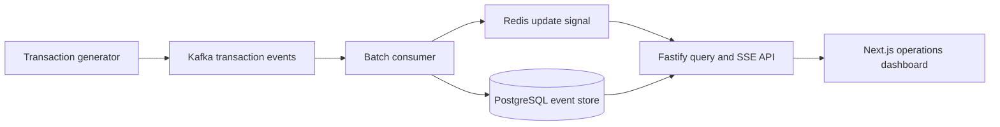

The prototype keeps transaction capture off the authorization path, persists events through a Kafka consumer, and pushes filtered operational views to the dashboard through the API.

## Source

### Transaction generator

- [services/generator/src/index.ts](./services/generator/src/index.ts) — Generates synthetic transaction events and emits them to Kafka without blocking the simulated authorization path.
- [services/generator/src/config.ts](./services/generator/src/config.ts) — Reads and validates generator rate, incident, and connection settings.

### Consumer and persistence

- [services/consumer/src/index.ts](./services/consumer/src/index.ts) — Consumes transaction batches from Kafka and coordinates persistence and notifications.
- [services/consumer/src/batchWriter.ts](./services/consumer/src/batchWriter.ts) — Writes consumed transaction batches to PostgreSQL and publishes update signals.
- [db/init.sql](./db/init.sql) — Defines the transaction event schema and supporting database objects.

### API

- [services/api/src/index.ts](./services/api/src/index.ts) — Boots the Fastify server and registers query and streaming routes.
- [services/api/src/db.ts](./services/api/src/db.ts) — Owns PostgreSQL access for dashboard queries.
- [services/api/src/filters.ts](./services/api/src/filters.ts) — Parses and applies tenant-aware dashboard filters.
- [services/api/src/redisSub.ts](./services/api/src/redisSub.ts) — Subscribes to Redis notifications used to refresh connected clients.
- [services/api/src/routes/query.ts](./services/api/src/routes/query.ts) — Serves filtered dashboard snapshots.
- [services/api/src/routes/stream.ts](./services/api/src/routes/stream.ts) — Streams live dashboard updates over Server-Sent Events.

### Dashboard

- [apps/dashboard/app/page.tsx](./apps/dashboard/app/page.tsx) — Composes the operations dashboard and coordinates its filter state.
- [apps/dashboard/app/layout.tsx](./apps/dashboard/app/layout.tsx) — Defines the dashboard application shell and global metadata.
- [apps/dashboard/app/components/DrilldownTable.tsx](./apps/dashboard/app/components/DrilldownTable.tsx) — Displays filtered transaction-level drill-down rows.
- [apps/dashboard/app/components/FilterBar.tsx](./apps/dashboard/app/components/FilterBar.tsx) — Provides tenant, role, transaction, outcome, vendor, and time filters.
- [apps/dashboard/app/components/LatencyPanel.tsx](./apps/dashboard/app/components/LatencyPanel.tsx) — Presents latency percentile metrics.
- [apps/dashboard/app/components/OutcomeBreakdown.tsx](./apps/dashboard/app/components/OutcomeBreakdown.tsx) — Visualizes transaction outcomes and approval behavior.
- [apps/dashboard/app/components/TrendChart.tsx](./apps/dashboard/app/components/TrendChart.tsx) — Charts transaction volume over time.
- [apps/dashboard/app/lib/queryUrl.ts](./apps/dashboard/app/lib/queryUrl.ts) — Builds API URLs from the active dashboard filters.
- [apps/dashboard/app/lib/useSse.ts](./apps/dashboard/app/lib/useSse.ts) — Manages the browser EventSource lifecycle and live snapshot state.
- [apps/dashboard/eslint.config.mjs](./apps/dashboard/eslint.config.mjs) — Configures linting for the dashboard workspace.
- [apps/dashboard/next-env.d.ts](./apps/dashboard/next-env.d.ts) — Supplies Next.js framework type declarations.
- [apps/dashboard/next.config.ts](./apps/dashboard/next.config.ts) — Configures the Next.js dashboard application.
- [apps/dashboard/postcss.config.mjs](./apps/dashboard/postcss.config.mjs) — Configures dashboard CSS processing.

### Shared contracts

- [packages/shared/src/types.ts](./packages/shared/src/types.ts) — Defines transaction, filter, metric, and API payload types shared across workspaces.

## Project documentation

- [README.md](./README.md) — Project setup, architecture rationale, demonstrations, and simplifications.
- [notes.md](./notes.md) — Exercise requirements, design exploration, alternatives, and final decisions.
- [apps/dashboard/README.md](./apps/dashboard/README.md) — Dashboard-specific development guidance.
- [apps/dashboard/AGENTS.md](./apps/dashboard/AGENTS.md) — Dashboard instructions for coding agents.
- [apps/dashboard/CLAUDE.md](./apps/dashboard/CLAUDE.md) — Dashboard-specific Claude guidance.
